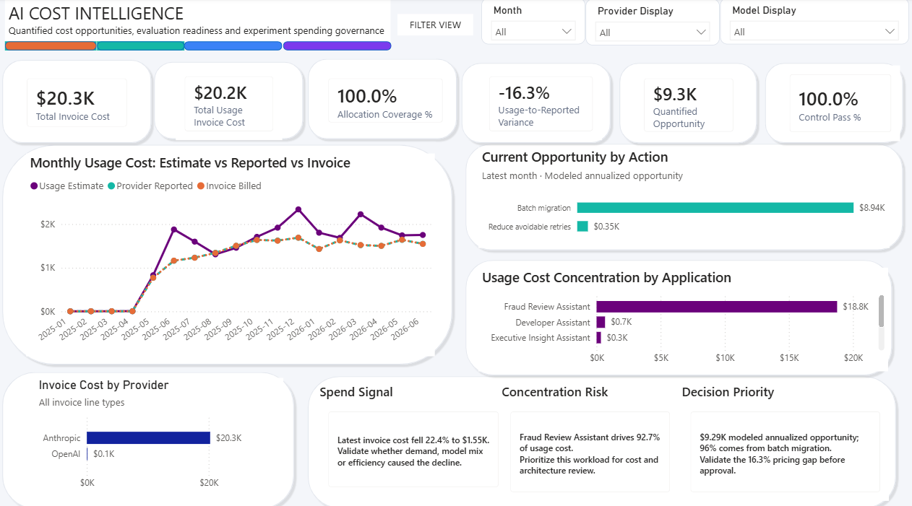
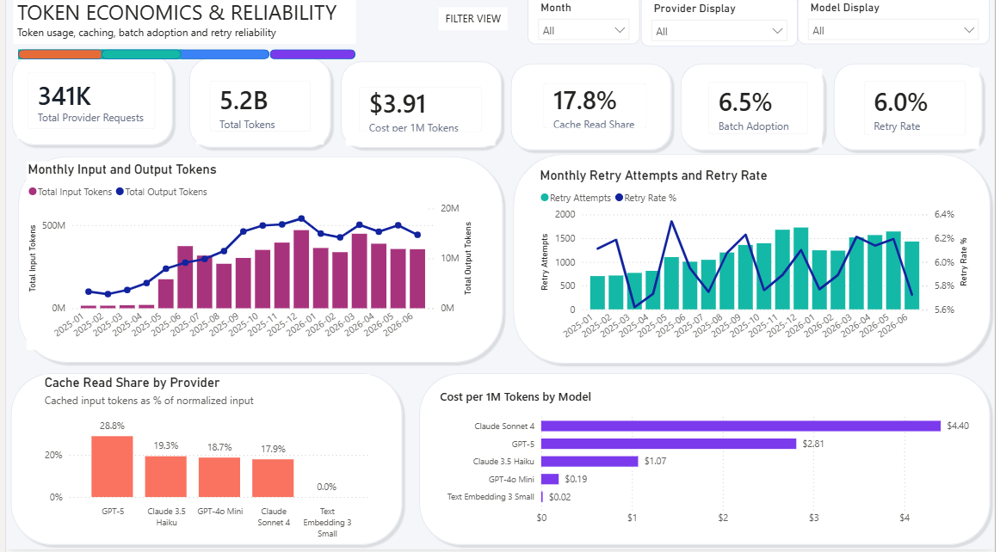
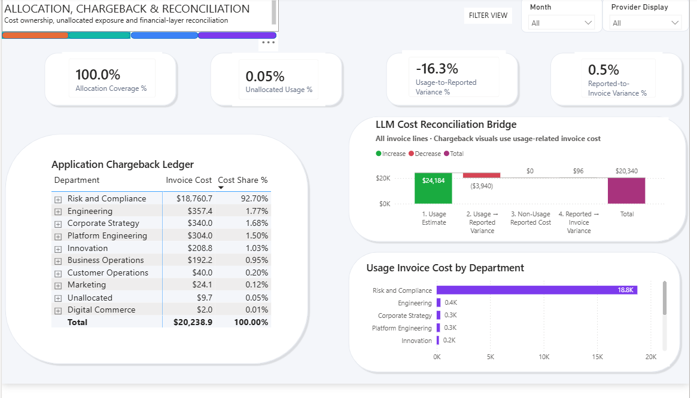
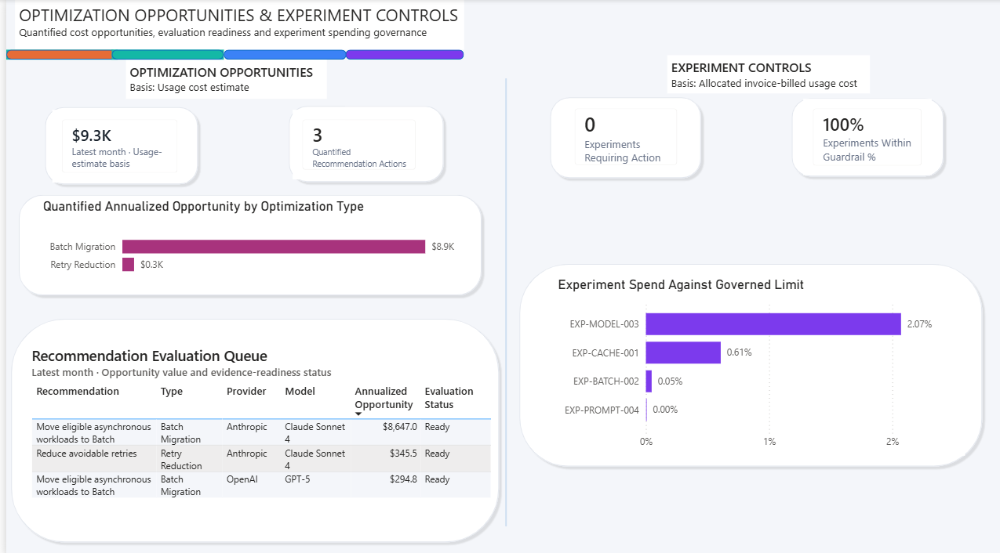

# LLM API Cost FinOps Platform

A portfolio-grade AI FinOps platform for measuring, reconciling, allocating, governing, and optimizing direct LLM API consumption across OpenAI and Anthropic.

**Status:** v1.0.0 complete; Phase 2 foundation begins on `phase-2`  
**Data:** Controlled synthetic enterprise dataset  
**Core stack:** Python, Google BigQuery, Power BI, GitHub Actions

---

## Executive Summary

Direct LLM API consumption introduces financial-management challenges that traditional cloud billing alone does not solve. Provider usage records, invoice data, application telemetry, ownership metadata, pricing history, retries, failures, caching, batching, experiments, and optimization decisions all need to be connected.

This project builds that end-to-end control layer.

It demonstrates how a FinOps team can answer:

- How much are we spending on LLM APIs?
- Which providers, models, applications, departments, and cost centers drive that spend?
- Does token-derived usage cost reconcile with provider-reported and invoice-billed cost?
- How much spend is directly allocated, indirectly allocated, or still unallocated?
- What is the cost per request, successful request, token, application, and experiment?
- How much cost is created by retries, failures, poor cache utilization, non-batch workloads, and model selection?
- Which optimization opportunities are financially meaningful and safe to pursue?
- Are experiments operating within approved financial limits?
- Can leadership trust the reporting and the underlying controls?

---

## Power BI Dashboard

### 1. AI Cost Intelligence

Executive visibility into LLM spend, provider mix, monthly trends, allocation coverage, reconciliation, and prioritized optimization opportunities.



### 2. Token Economics and Reliability

Analysis of input and output tokens, cache-read behavior, retry overhead, request reliability, model mix, and unit cost.



### 3. Allocation, Chargeback and Reconciliation

Application and department ownership, allocation confidence, unallocated cost, chargeback reporting, and the financial reconciliation bridge.



### 4. Optimization and Experiment Controls

Optimization recommendations, modeled annualized opportunity, evaluation gates, experiment limits, and governance decisions.



---

## Demonstrated Results

The figures below come from the controlled synthetic dataset and demonstrate the platform's analytical capabilities.

| Measure | Result |
|---|---:|
| Invoice-billed LLM cost | $20,340.15 |
| Provider-reported cost | $20,243.73 |
| Logical requests | 347,775 |
| Request telemetry records | 369,921 |
| Retry attempts | 22,146 |
| Allocation coverage | Approximately 99.95% |
| Modeled annualized optimization opportunity | Approximately $9.29K |
| Providers | OpenAI and Anthropic |

The optimization amount is an **identified and modeled opportunity**. It is not presented as approved, implemented, verified, or realized savings.

---

## Core Capabilities

### Cost Visibility

- Provider usage and cost ingestion
- Historical and effective-dated model pricing
- Input, output, cache-write, and cache-read token economics
- Request, provider, model, application, department, and cost-center analysis
- Daily and monthly cost trends
- Usage, reported, and invoice financial views

### Financial Reconciliation

The platform keeps three financial amounts separate:

1. **Usage Cost Estimate**
2. **Provider-Reported Cost**
3. **Invoice-Billed Cost**

The main reconciliation layers are:

```text
Usage-to-Reported Variance
= Provider-Reported Usage Cost - Usage Cost Estimate
```

```text
Reported-to-Invoice Variance
= Invoice-Billed Cost - Provider-Reported Cost
```

Only usage lines receive a token-derived usage estimate. Taxes, credits, true-ups, corrections, and adjustments remain visible as non-usage financial lines.

### Allocation and Chargeback

- Direct application ownership
- Department and cost-center attribution
- Confidence-based allocation
- Visible unallocated spend
- Application and department showback
- Invoice-aligned chargeback reporting
- Allocation coverage controls

### Token and Request Economics

- Cost per logical request
- Cost per successful request
- Cost per one million tokens
- Input-to-output token relationships
- Cache-read economics
- Retry and failure overhead
- Model and service-tier comparison
- Application-level unit economics

### Optimization Governance

- Prompt-caching opportunities
- Batch-processing candidates
- Model-routing opportunities
- Retry reduction
- Failure-cost reduction
- Context-window optimization
- Financial impact estimation
- Evaluation and quality gates
- Recommendation status tracking

### Experiment Governance

- Experiment owner
- Business hypothesis
- Spending limit
- Actual experiment cost
- Spend-to-limit monitoring
- Financial evidence status
- Measurement limitations
- Stop, Continue, Modify, or Scale decision
- Promotion and retirement controls

### Automated Controls

- Raw-load reconciliation
- Pricing completeness
- Attribution coverage
- Financial variance checks
- Telemetry completeness
- Optimization integrity
- Experiment-limit controls
- Pipeline status validation
- Semantic-model validation
- GitHub Actions quality workflow

---

## Architecture

```text
Provider usage records ───────────────┐
Provider cost and invoice records ────┼──> Raw BigQuery layer
Request and gateway telemetry ────────┤
Ownership and governance mappings ────┘
                                              │
                                              ▼
                               Staging and normalization
                                              │
                    ┌─────────────────────────┼─────────────────────────┐
                    ▼                         ▼                         ▼
             Usage pricing          Request telemetry        Provider financials
                    │                         │                         │
                    └─────────────────────────┼─────────────────────────┘
                                              ▼
                               Financial reconciliation
                                              │
                    ┌─────────────────────────┼──────────────────────────┐
                    ▼                         ▼                          ▼
              Daily allocation        Token economics          Application cost
                    │                         │                          │
                    ├─────────────┬───────────┴───────────┬──────────────┤
                    ▼             ▼                       ▼              ▼
              Unit economics  Optimization          Experiments    Controls
                    │             │                       │              │
                    └─────────────┴───────────────────────┴──────────────┘
                                              ▼
                                  Power BI semantic model
                                              │
                                              ▼
                                  Executive reporting
```

---

## Technology Stack

| Layer | Technology |
|---|---|
| Source generation | Python |
| Validation and testing | Python and pytest |
| Data warehouse | Google BigQuery |
| Transformation | BigQuery SQL |
| Configuration | YAML and CSV |
| Semantic model | Power BI |
| Reporting | Power BI |
| Automation | PowerShell and Python |
| Continuous integration | GitHub Actions |
| Version control | Git and GitHub |

---

## Data Model

### Raw and Staging Layers

- Provider usage
- Provider cost and invoice lines
- Request telemetry
- Model pricing
- Ownership mappings
- Service-tier mappings
- Normalized and priced usage

### Core Financial Facts

- Monthly usage cost
- Monthly cost reconciliation
- Daily usage allocation
- Daily telemetry reconciliation

### Analytical Marts

- Telemetry coverage
- Token economics
- Application cost and chargeback
- Optimization opportunities
- Unit economics
- Experiment governance
- Control status
- Pipeline status

### Power BI Semantic Layer

- Date dimension
- Provider dimension
- Model dimension
- Application dimension
- Experiment dimension
- Monthly financial fact
- Monthly usage fact
- Monthly unit-economics fact
- Monthly optimization fact
- Current experiment fact

---

## Repository Structure

```text
.
├── .github/workflows/       # GitHub Actions quality workflow
├── config/                  # Pricing, controls, experiments, and deployment configuration
├── data/                    # Raw placeholders and locally generated data
├── docs/                    # Architecture, contracts, financial definitions, operating guides, and release documentation
├── powerbi/screenshots/     # Final Power BI dashboard screenshots
├── scripts/                 # Deployment, validation, recovery, and CI scripts
├── sql/
│   ├── 00_setup/            # BigQuery dataset setup
│   ├── 01_raw/              # Raw-layer definitions
│   ├── 02_staging/          # Normalization and pricing
│   ├── 03_core/             # Reconciliation and allocation facts
│   ├── 04_marts/            # Analytical marts
│   ├── 05_controls/         # Financial and data-quality controls
│   └── 06_semantic/         # Power BI semantic tables
├── src/llm_finops/          # Python generation, validation, and guarded shared BigQuery runner
├── tests/                   # Automated unit, integration, SQL, and repository-quality tests
└── README.md
```

---

## Running the Project Locally

### 1. Clone the repository

```powershell
git clone https://github.com/Venkat-Poladi/llm-api-cost-finops-platform.git
cd llm-api-cost-finops-platform
```

### 2. Create the Python environment

```powershell
py -3.11 -m venv .venv
& .\.venv\Scripts\python.exe -m pip install --upgrade pip
& .\.venv\Scripts\python.exe -m pip install -r requirements.txt
```

### 3. Generate the deterministic source data

```powershell
& .\.venv\Scripts\python.exe .\scripts\generate_sources.py --overwrite
```

### 4. Run the automated tests

```powershell
& .\.venv\Scripts\python.exe -m pytest -q
```

### 5. Run the complete repository validation

```powershell
& .\.venv\Scripts\python.exe .\scripts\run_repo_ci.py
```

The local workflow validates source generation, schema contracts, SQL
hardening, controls, semantic-model artifacts, linting, and automated tests.
BigQuery deployment requires an authenticated Google Cloud project and the
configuration files under `config/`. Deployment entry points share one guarded
runner for configuration resolution, identifier validation, SQL execution,
control evaluation, manifest creation, and pipeline logging. Set
`GOOGLE_CLOUD_PROJECT` to override the repository default without editing YAML;
an explicit `--project-id` argument takes precedence over the environment.

## Implementation Status

| Capability | Status |
|---|---|
| Provider evidence and controlled synthetic source generation | Complete |
| BigQuery raw ingestion, normalization, and effective-dated pricing | Complete |
| Financial reconciliation, allocation, showback, and chargeback | Complete |
| Token, request, application, and unit economics | Complete |
| Optimization evaluation and experiment financial governance | Complete |
| Shared guarded deployment runner, identifier validation, failure logging, and CI | Complete |
| Power BI semantic model and executive reporting | Complete |
| Portfolio documentation and reproducible release artifacts | Complete |

## Releases and Phase 2

- **v1.0.0** freezes the completed OpenAI and Anthropic implementation, governed metrics, Power BI evidence, and clean-repository validation.
- The implementation baseline is commit `c2a2449`; the `v1.0.0` tag contains the M20 documentation and evidence freeze without changing v1 analytical logic.
- Phase 2 continues on branch `phase-2` and extends the platform through governed milestones rather than rebuilding working v1 capabilities.

Release evidence:

- [`docs/releases/v1.0.0.md`](docs/releases/v1.0.0.md)
- [`docs/releases/v1_metric_baseline.md`](docs/releases/v1_metric_baseline.md)
- [`docs/releases/v1_reconciliation_evidence.md`](docs/releases/v1_reconciliation_evidence.md)
- [`docs/capability_status.md`](docs/capability_status.md)
- [`docs/v2_build_plan.md`](docs/v2_build_plan.md)

## Financial and Data Disclaimer

This repository uses controlled synthetic data designed to represent realistic enterprise LLM usage, pricing, telemetry, allocation, invoice, and governance patterns.

The dataset does not represent the confidential operations or financial records of an actual organization.

Financial amounts are used to demonstrate:

- Cost-estimation methodology
- Provider and invoice reconciliation
- Allocation and chargeback
- Token and request unit economics
- Optimization modeling
- Experiment governance
- Executive reporting

Modeled optimization opportunities are not claimed as realized savings. Business-value and ROI measurement would require integration with actual product, quality, revenue, productivity, adoption, and customer-outcome systems.

---

## Key Design Principles

- Keep estimated, reported, and invoiced cost separate
- Preserve taxes, credits, corrections, and true-ups as visible financial lines
- Keep unallocated cost visible rather than forcing false ownership
- Separate identified opportunity from approved, implemented, verified, and realized savings
- Use effective-dated pricing instead of hard-coded current prices
- Tie experiment decisions to both financial and evaluation evidence
- Reconcile dashboard totals to governed warehouse facts
- Make every important assumption and limitation explicit

---

## Phase 2 Roadmap and Boundaries

Phase 2 is planned to add:

- Amazon Bedrock and Vertex AI/Gemini provider channels
- Limited supporting AWS and GCP infrastructure cost
- One small hosted-inference/GPU endpoint
- A governed annual AI budget of **$76,438.52**
- Driver-based forecasting and explainable variance
- Fully loaded workload cost
- Quality, latency, anomaly, and guardrail analysis
- Provider and contract economics
- Expanded Power BI, Excel, and PowerPoint decision support

Phase 2 explicitly excludes Azure OpenAI, large-scale training, a large GPU fleet, multiple currencies, autonomous provider-side shutdown, an AI FinOps chatbot, and unverified business-ROI claims. See [`docs/v2_build_plan.md`](docs/v2_build_plan.md) and [`docs/v2_known_limitations.md`](docs/v2_known_limitations.md).

---

## Portfolio Value

This project demonstrates practical capability across:

- AI and LLM cost management
- FinOps allocation and chargeback
- Financial reconciliation
- Token and request unit economics
- BigQuery data engineering
- Power BI semantic modeling and executive reporting
- Experiment governance
- Optimization controls
- Automated validation and CI
- Transparent synthetic-data methodology

It is designed to show how engineering, finance, product, and governance teams can manage AI consumption using one connected analytical and operating model.
